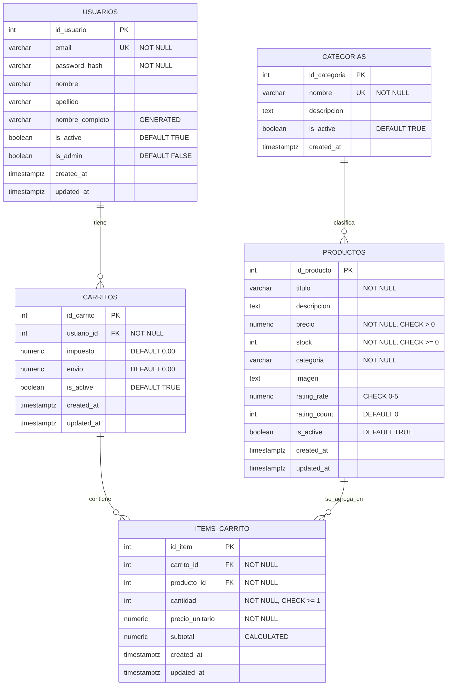

# Diagrama Entidad-Relación - Mini Market Universitario

## Diagrama ER Detallado (Mermaid)



## Diagrama Simplificado (ASCII)

```
┌─────────────┐
│  USUARIOS   │
│─────────────│
│ id_usuario  │◄─┐
│ email       │  │
│ password    │  │
│ nombre      │  │
│ ...         │  │
└─────────────┘  │
                 │ 1:N
                 │ (tiene)
┌─────────────┐  │
│  CARRITOS   │  │
│─────────────│  │
│ id_carrito  │  │
│ usuario_id  │──┘
│ impuesto    │
│ envio       │◄─┐
│ is_active   │  │
└─────────────┘  │
                 │ 1:N
                 │ (contiene)
┌──────────────┐ │
│ITEMS_CARRITO │ │
│──────────────│ │
│ id_item      │ │
│ carrito_id   │─┘
│ producto_id  │─┐
│ cantidad     │ │
│ precio_unit. │ │
│ subtotal     │ │
└──────────────┘ │
                 │ N:1
                 │ (referencia)
┌─────────────┐  │
│  PRODUCTOS  │  │
│─────────────│  │
│ id_producto │◄─┘
│ titulo      │
│ precio      │
│ stock       │
│ categoria   │
│ rating      │
│ ...         │
└─────────────┘
```

## Cardinalidades y Reglas de Negocio

### 1. Usuario → Carrito (1:N)
- **Cardinalidad**: Un usuario puede tener múltiples carritos
- **Regla**: Solo **un carrito activo** por usuario (is_active = TRUE)
- **Integridad**: ON DELETE CASCADE (borrar usuario → borrar carritos)

### 2. Carrito → ItemCarrito (1:N)
- **Cardinalidad**: Un carrito puede tener múltiples items
- **Regla**: No duplicar productos en mismo carrito (UNIQUE constraint)
- **Integridad**: ON DELETE CASCADE (borrar carrito → borrar items)

### 3. Producto → ItemCarrito (1:N)
- **Cardinalidad**: Un producto puede estar en múltiples items de carrito
- **Regla**: Validar stock disponible antes de agregar (trigger)
- **Integridad**: ON DELETE RESTRICT (no borrar productos en uso)

### 4. Categoría → Producto (1:N) [Opcional]
- **Cardinalidad**: Una categoría puede tener múltiples productos
- **Regla**: Categoría normalizada en tabla separada
- **Integridad**: ON DELETE RESTRICT o SET NULL

## Restricciones Principales

### Restricciones de Dominio
| Campo | Restricción | Descripción |
|-------|-------------|-------------|
| `precio` | `CHECK (precio > 0)` | Precio debe ser positivo |
| `stock` | `CHECK (stock >= 0)` | Stock no puede ser negativo |
| `cantidad` | `CHECK (cantidad >= 1)` | Cantidad mínima: 1 |
| `rating_rate` | `CHECK (rating_rate BETWEEN 0 AND 5)` | Calificación entre 0 y 5 |
| `subtotal` | `CHECK (subtotal = precio_unitario * cantidad)` | Coherencia de cálculo |

### Restricciones de Unicidad
| Tabla | Campos | Descripción |
|-------|--------|-------------|
| `usuarios` | `email` | No duplicar emails |
| `carritos` | `(usuario_id) WHERE is_active` | Solo un carrito activo por usuario |
| `items_carrito` | `(carrito_id, producto_id)` | No duplicar producto en carrito |
| `categorias` | `nombre` | Nombres únicos de categorías |

## Índices para Performance

### Índices B-Tree (búsquedas exactas)
```sql
CREATE INDEX idx_usuarios_email ON usuarios(email);
CREATE INDEX idx_productos_categoria ON productos(categoria);
CREATE INDEX idx_productos_precio ON productos(precio);
CREATE INDEX idx_carritos_usuario ON carritos(usuario_id);
CREATE INDEX idx_items_carrito ON items_carrito(carrito_id);
CREATE INDEX idx_items_producto ON items_carrito(producto_id);
```

### Índices Parciales (filtros frecuentes)
```sql
CREATE INDEX idx_usuarios_active ON usuarios(is_active) 
    WHERE is_active = TRUE;

CREATE INDEX idx_productos_active ON productos(is_active) 
    WHERE is_active = TRUE;

CREATE INDEX idx_carritos_active ON carritos(is_active) 
    WHERE is_active = TRUE;
```

### Índices Full-Text Search
```sql
CREATE INDEX idx_productos_titulo_busqueda 
    ON productos USING gin(to_tsvector('spanish', titulo));
```

### Índices Únicos Compuestos
```sql
CREATE UNIQUE INDEX ux_carritos_usuario_activo 
    ON carritos(usuario_id) WHERE is_active = TRUE;

CREATE UNIQUE INDEX ux_items_carrito_producto 
    ON items_carrito(carrito_id, producto_id);
```

## Triggers y Funciones

### 1. Auto-actualización de timestamps
```sql
-- Actualiza updated_at automáticamente
CREATE TRIGGER tr_usuarios_updated_at
    BEFORE UPDATE ON usuarios
    FOR EACH ROW
    EXECUTE FUNCTION actualizar_updated_at();
```

### 2. Cálculo automático de subtotal
```sql
-- Calcula subtotal = precio_unitario × cantidad
CREATE TRIGGER tr_items_calcular_subtotal
    BEFORE INSERT OR UPDATE OF cantidad, precio_unitario 
    ON items_carrito
    FOR EACH ROW
    EXECUTE FUNCTION calcular_subtotal_item();
```

### 3. Validación de stock
```sql
-- Valida stock disponible antes de agregar/actualizar
CREATE TRIGGER tr_items_validar_stock
    BEFORE INSERT OR UPDATE OF cantidad ON items_carrito
    FOR EACH ROW
    EXECUTE FUNCTION validar_stock_disponible();
```

## Vistas Predefinidas

### Vista: Carritos con Detalle
```sql
CREATE VIEW vista_carritos_detallados AS
SELECT 
    c.id_carrito,
    c.usuario_id,
    u.email AS usuario_email,
    ic.id_item,
    p.titulo AS producto_titulo,
    ic.cantidad,
    ic.precio_unitario,
    ic.subtotal,
    c.impuesto,
    c.envio
FROM carritos c
INNER JOIN usuarios u ON c.usuario_id = u.id_usuario
LEFT JOIN items_carrito ic ON c.id_carrito = ic.carrito_id
LEFT JOIN productos p ON ic.producto_id = p.id_producto;
```

### Vista: Resumen de Totales
```sql
CREATE VIEW vista_carritos_resumen AS
SELECT 
    c.id_carrito,
    c.usuario_id,
    COUNT(ic.id_item) AS total_items,
    SUM(ic.cantidad) AS total_productos,
    SUM(ic.subtotal) AS subtotal,
    c.impuesto,
    c.envio,
    SUM(ic.subtotal) + c.impuesto + c.envio AS total
FROM carritos c
LEFT JOIN items_carrito ic ON c.id_carrito = ic.carrito_id
GROUP BY c.id_carrito;
```

## Normalización Aplicada

### Primera Forma Normal (1FN) ✅
- Todos los atributos son atómicos (valores indivisibles)
- No hay grupos repetidos
- Cada columna contiene un solo valor

### Segunda Forma Normal (2FN) ✅
- Cumple 1FN
- Todos los atributos no-clave dependen completamente de la PK
- No hay dependencias parciales

### Tercera Forma Normal (3FN) ✅
- Cumple 2FN
- No hay dependencias transitivas
- `nombre_completo` es campo calculado (no redundante)
- `categorias` normalizada en tabla separada

## Ejemplos de Consultas JOIN

### Obtener carrito completo de un usuario
```sql
SELECT 
    u.email,
    u.nombre_completo,
    c.id_carrito,
    p.titulo AS producto,
    ic.cantidad,
    ic.precio_unitario,
    ic.subtotal,
    c.impuesto,
    c.envio,
    (SELECT SUM(subtotal) FROM items_carrito WHERE carrito_id = c.id_carrito) 
        + c.impuesto + c.envio AS total
FROM usuarios u
INNER JOIN carritos c ON u.id_usuario = c.usuario_id
INNER JOIN items_carrito ic ON c.id_carrito = ic.carrito_id
INNER JOIN productos p ON ic.producto_id = p.id_producto
WHERE u.id_usuario = 1 
  AND c.is_active = TRUE;
```

### Productos más vendidos
```sql
SELECT 
    p.id_producto,
    p.titulo,
    p.categoria,
    COUNT(ic.id_item) AS veces_agregado,
    SUM(ic.cantidad) AS unidades_totales
FROM productos p
INNER JOIN items_carrito ic ON p.id_producto = ic.producto_id
GROUP BY p.id_producto, p.titulo, p.categoria
ORDER BY unidades_totales DESC
LIMIT 10;
```

---

**Nota**: Este diagrama se puede visualizar directamente en GitHub, GitLab, o cualquier editor que soporte Mermaid (VS Code con extensión, Obsidian, etc.)
